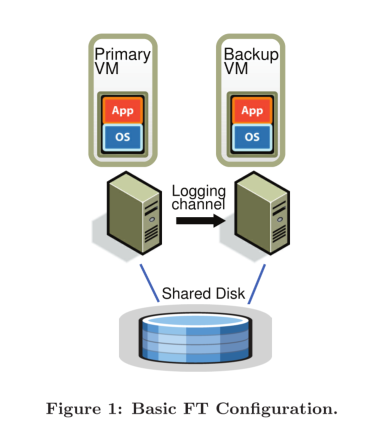

BASIC FT DESIGN

图1展示了我们系统在故障容忍VMs的基本步骤。对于一个给定的VM，我们希望提供故障容忍（主VM），我们在一个完全不同的物理机器上运行一个备份VM，保持和主VM同步并且执行一致，虽然存在短时间的滞后。我们说这两个VMs是虚拟的步调一致。VMs的虚拟磁盘是在一个**共享存储**中的（例如一个Fibre Channel或者iSCSI磁盘阵列），因此可以接受主备服务器的输入和输出。（我们将在4.1节中讨论带有分隔的非共享虚拟磁盘的主备VM的设计）只有主VM会说明它在网络中的存在，因此所有网络输入都会来到主VM上。相似地，所有其他输入（例如键盘和鼠标）也只会来到主VM上。

所有主VM接收到的输入都会通过名为logging channel的网络连接，被发送到备份VM上。对于几个工作负载而言，主要的输入途径是网络和磁盘。为了保证备份VM和主VM使用相同的方式执行非确定性操作，下面2.1节讨论的额外的信息也需要发送。结果备份VM总是执行和主VM一致的操作。然而，备份VM的输出会被管理程序扔掉，因此只有主VM产生实际输出，并被返回给客户端。和2.2节中描述的一样，为了确保主VM失败后没有数据丢失，主备VM遵循一个具体的协议，包括备份VM明确的确认信息。

为了检测主或备份虚拟机是否失败，我们的系统**既使用相关服务器间的心跳机制，同时也监测 logging channel 上的流量**。另外，我们我们必须确保**只有主或备份VM执行操作**，即使存在脑裂（split brain）的场景，在这种场景中主备服务器互相之间会失去通信。

在下面的小节中，我们在几个重要的方面提供更多的细节。在2.1节中，我们给出一些确定性重放技术的细节，保证主备VMs通过 logging channel 上的信息保持一致。在2.2节中，我们描述了我们的FT协议中的一个基础规则，保证了主VM失败后没有数据丢失。在2.3节中，我们描述我们的方法，它能够通过正确的方式检测及响应故障。