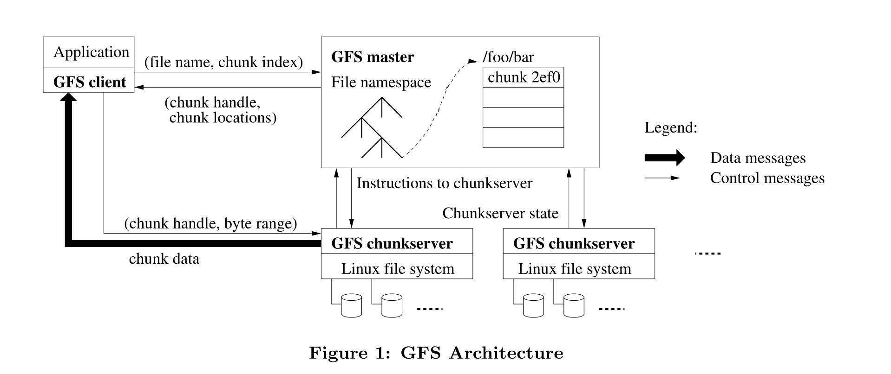
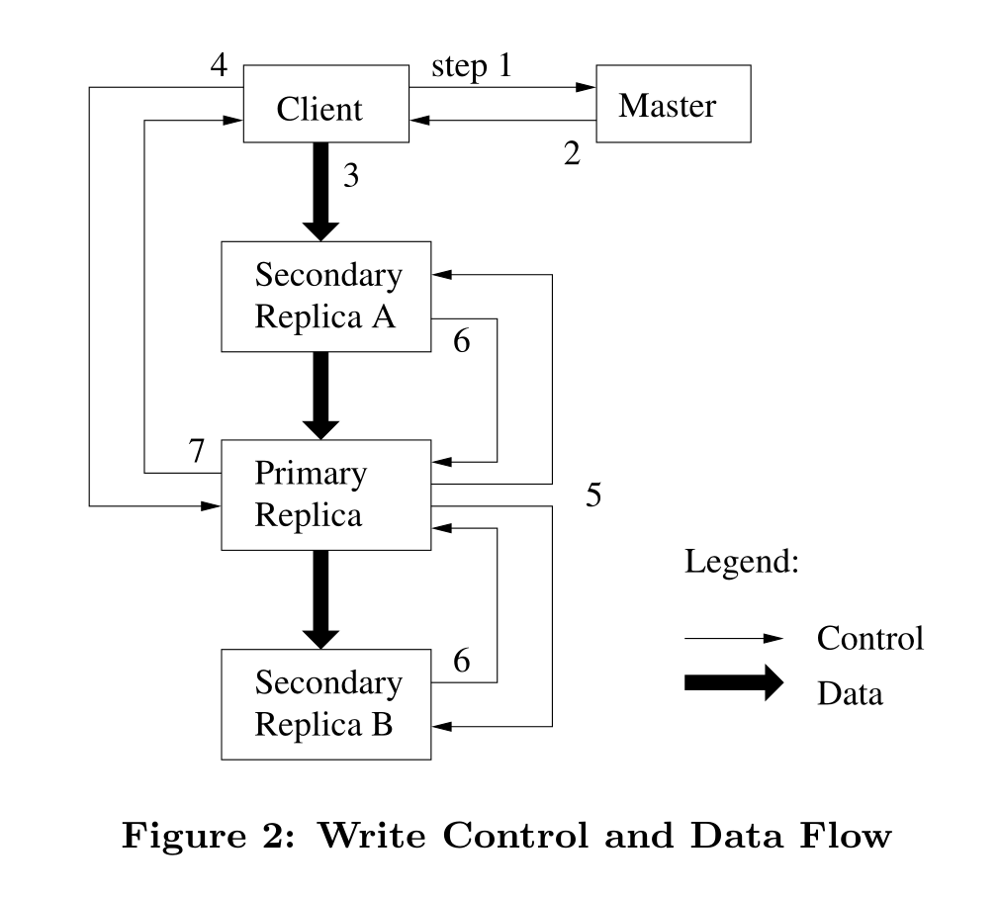

## GFS

### 引言

GFS是为了满足谷歌快速增长的数据处理需求而提出的。

1. 文件系统包含成千上万的廉价的存储机器，会因为各种各样的原因而发生故障，所以系统必须包含持续监控、错误检测、容错和自动恢复的功能。

2. 文件大小：几GB的文件是比较常见的；而且经常处理由数亿个对象组成的TB级别的数据集，管理数十亿个kb大小的文件非常不方便。所以必须更合适地设计I/O操作和块大小的参数。
3. 大多数情况下文件是追加写操作而不是重写，一旦写后，文件大多数场景下知识有序地读。比如数据分析程序扫描的大型存储库、由运行的应用程序连续生产的数据流、档案资料、由一台机器产生的中间结果并且在另外一台机器上处理。考虑到这种对大文件的访问模式，追加成为性能优化和原子性保证的重点，而在客户机中缓存数据块则失去了吸引力。
4. 共同设计应用程序和文件系统API可以增加我们的灵活性，从而使整个系统受益。放宽了GFS的一致性模型以简化文件系统？（不太理解什么意思）GFS引入了原子的的追加写操作，使多个客户机并发追加到一个文件，无需再进行同步操作。

### 设计概述

#### 假设

1. 系统由许多经常失效的廉价机器构成，所以必须不断地自我监控、检测、错误容忍和故障恢复。
2. 系统存储少量的大文件、大部分文件大小通常为100MB
3. 工作负载主要包括两种类型的读：大的数据流读取和小的随机读取。前者读几千KB，读取一个文件的连续区域；后者读取文件中带偏移量的KB级别数据。注重性能的应用程序通常对小的读取进行批处理和排序。
4. 这些工作负载还有许多大的、顺序的写操作，将数据附加到文件中。典型的操作大小与读操作大小相似。文件一旦写入，就很少再被修改。支持在文件中的任意位置进行小的写操作，但不一定要高效。
5. 系统必须有效地为并发追加到同一文件的多个客户端实现定义良好的语义。我们的文件通常用作生产者-消费者队列或用于多路合并。数百个生产者，每台机器运行一个，将并发地追加到一个文件。具有最小同步开销的原子性是必不可少的。该文件可以稍后读取，或者消费者可以同时读取该文件。
6. 高持续带宽比低时延更重要，追求高效批处理数据，很少有对单个读写有严格的时间响应要求。

#### 接口

文件在目录中按照层级组织，由路径名标识。支持创建、删除、打开、关闭、读写。还指出快照和record append。记录追加允许多个客户端并发地向同一个文件追加数据，同时保证每个客户端追加的原子性。

#### 结构

包含一个master和多个chunkserver，被多个client客户端访问。每一个都是普通Liunx机器下的用户级进程。

在GFS中文件都是被划分成固定大小的块进行管理存储的（正好对应MapReduce中的文件划分），每块有一个64位标识符（chunk handle），它是在 chunk 被创建时由 master 分配的，默认每一个 chunk 会有3个备份，分别在不同的机器上

Master 存储所有的 metadata，包括命名空间（namespace）、访问控制信息（access control）、文件与 chunk 的映射关系（mapping）以及 chunk 的存储位置。每一个chunk都是由一个chunk handle来标识和管理，和改文件块的所有交互都是通过与其对应的handle完成的，所以master必须要存储一些元信息，比如chunk handle等。

Client 会和 master 以及 chunkserver 进行交互，client向 master 请求 metadata，然后向 chunkserver 进行读写操作。client 与 chunkserver 都不会缓存文件数据，为的是防止数据出现不一致的状况。但是 client 会缓存 metadata 的信息（但是会出现一个问题，如果 metadata 过期怎么办呢？GFS 给出了自己的解决方案，也就是租约 lease）

#### Single Master

客户端询问master它应该联系哪一块chunkserver。首先客户端翻译文件名和字节偏移量位chunk索引，然后向matser发送请求，master回应标识符（chunk handle）和备份的位置，客户端以文件名和chunk索引为key来缓存这些信息。然后客户端发送请求给其中一个备份（很可能是最近的）

#### Chunk Size

64MB

GFS 中将 chunk 的大小定为 64MB，它比一般的文件系统的块大小要大。
优点：（上面已经叙述过）
（1）减少 client 与 master 的交互
（2）client 可以在一个块上执行更多的操作，通过 TCP 长连接减少网络压力
（3）减小 metadata 的大小
缺点：
（1）一个 chunk 可以存更多的小文件了，这样的话如果有一个块存储了许多小文件，client 和它进行操作的几率大大提高，这个 chunk 的压力会很大，会形成热点块（然而在实际中，这个问题影响并不大）
（2）在批处理系统中存在很大问题（如果在一个 chunk 上有一个可执行文件，同时有许多 client 都要请求执行这个文件，它的压力会很大。解决方案是把该文件在不同的 chunkserver 上多添加几个备份，更长久的方案是应该允许 client 去读取其他 client 的文件）

#### Metadata

GFS 的 metadata 存储着 3 种类型的信息：
（1）文件名以及 chunk 的名称
（2）文件与 chunk 的映射关系
（3）各个备份（replicas）的位置
Metadata 通常存储于内存中，那么我们就会疑问这不会造成数据丢失吗？于是GFS也将前两种信息存于磁盘中，它们会作为操作记录（operation log）备份的一部分存储于磁盘，备份于远程机器。而 operation log作为唯一的持久化数据，它是至关重要的，如果master crash，那只能靠operation log来恢复数据。

并不保存chunk的位置，启动的时候轮询chunk服务器获取信息

我们思考一下，为什么不需要保存chunk的位置信息，因为master可以通过定期的 heartbeat 进行更新，得知每一个chunksever上的chunk信息（chunkserver 上有一个 final word，它表示了哪个 chunk 在它的磁盘上，哪个 chunk 不在）。而如果持久化保存其位置信息，每次chunkserver上的chunk位置发生变动都得同步到master上，这无疑造成了master的不必要的负担。

#### Operation log

记录元数据信息的改变。它不仅是元数据的唯一持久记录，而且还用作定义并发操作顺序的逻辑时间线。

在多台远程机器上复制它，并且只有在本地和远程将相应的日志记录刷新到磁盘之后才响应客户机操作。

通过checkpoint（检查点） 与 log files进行恢复

#### Consistency Model

https://blog.csdn.net/qiaojialin/article/details/71574203

首先解释一下和一致性有关的几个基本概念：
（1）一致性（consistent）：所有客户端无论读取哪个 Replica 都会读取到相同的内容，那这部分文件就是一致的；相反，如果客户端读取到的内容不同，那这部分文件就是不一致的。
（2）确定性（Defined）：在某种程度上讲，这个是比一致性更高的要求。Defined 的意思是知道这个文件是谁写的（那么谁知道呢？肯定是自己知道，其他客户端看不到文件的创建者）。也就是当前客户端在写完之后，再读数据，肯定能读到刚才自己写的。——可能有点不好理解，想想一个MySQL集群的多个MySQL实例，是如何保证多个实例的数据一致性的。bingo！确定一个主实例，串行化所有写操作，然后在其他实例重放相同的操作序列，以保证多个实例数据的一致性。master也是同样的方法。我们举个栗子：两个并发写请求A、B操作同一个文件的同一个位置，此时master得到了之后，会随机对这两个指令进行排序，自然后面执行的指令会覆盖前一个指令的操作。而对于A、B而言，他们都无法预料到最终是谁写成功了，所以这时就为undefined，但是这种情况确是满足一致性的（保证最终一致性）。

### system interactions

使用(leases)去维持(mutation)顺序操作的一致性

primary

分布式应用环境中，租约是一个使用物理时钟处理主机和通信失败的一致性协议。

租约是一种协议，该协议赋予持有该协议者在某个属性性特定的有限时间的权利。在缓存中，即服务器给予客户端在一定期限内可以控制修改操作的 权力，比如在数据被写入之前，服务器必须获取租约持有者的批准。客户端从服务器读取数据时往往就同时获取租约

在GFS文件系统中：Master节点为Chunk的一个副本建立一个租约，我们把这个副本叫做主Chunk。主 Chunk对Chunk的所有更改操作进行序列化。所有的副本都遵从这个序列进行修改操作。因此，修改操作全局的顺序首先由Master节点选择的租约的 顺序决定，然后由租约中主Chunk分配的序列号决定。GFS文件系统中为了保持高可用，必须拥有数据副本，而为了提高客户端响应速度，客户端不需要写多份数据，仅需要写一份数据到主chunk数据即可。

1. 客户端询问 master 哪个 chunkserver 持有块的当前租约以及其它块的副本位置。如果没有 chunkserver 持有租约，master 会对它选择的一个副本赋予租约（图中没有展示）。
2. master 回复 primary 的标识以及*其它副本（secondary）* 的位置。客户端会为将来的变更缓存这份数据。仅当 primary 不可到达（unreachable）或者 primary 回复其不再持有租约时，客户端才需要再次联系 master。
3. 客户端把数据推送到所有的副本。客户端可以以任意顺序推送数据。每个 chunkserver 会把数据存储在内部的 LRU buffer 缓存，直到数据被使用或超期（age out）。通过从控制流中将数据流解耦，我们可以根据网络拓扑来调度开销较大的数据流，而不必关心哪个 chunkserver 是 primary，从而改善性能。Section 3.2 对此进行了更深入的讨论。
4. 一旦所有的副本都确认收到了数据，客户端就会给 primary 发送一个写请求。这个请求标识了之前被推送到所有副本的数据。primary 为其收到的所有变更分配连续的序列号，这些变更可能来自于多个客户端，序列号提供了必要的编序。primary 依据序列号顺序将变更应用到自己的本地状态。
5.  primary 转发写请求到所有的从副本（secondary replicas），每个从副本以 primary 分配的相同的序列号顺序应用变更。
6. 所有的从副本对 primary 进行回复以表明它们完成了操作。
7. primary 对客户端进行回复。在任何副本上出现的任何错误都会报告给客户端。 在发生错误的情况下，写操作可能已经在 primary 和从副本的某个子集上执行成功（如果它在 primary 上失败，就不会被分配一个序列号和被转发）。这个客户端请求被当作是失败的，且被修改的区域停留在不一致状态。我们的客户端代码通过重试失败的变更来处理这样的错误。它在从写操作开头进行重试之前会在步骤（3）和（7）之间进行几次尝试。

如果应用程序的一个写操作比较大或跨越了块的边界，GFS 客户端代码会把它拆解为多个写操作。

中文翻译：

https://zhuanlan.zhihu.com/p/522459187

### P3.course

 