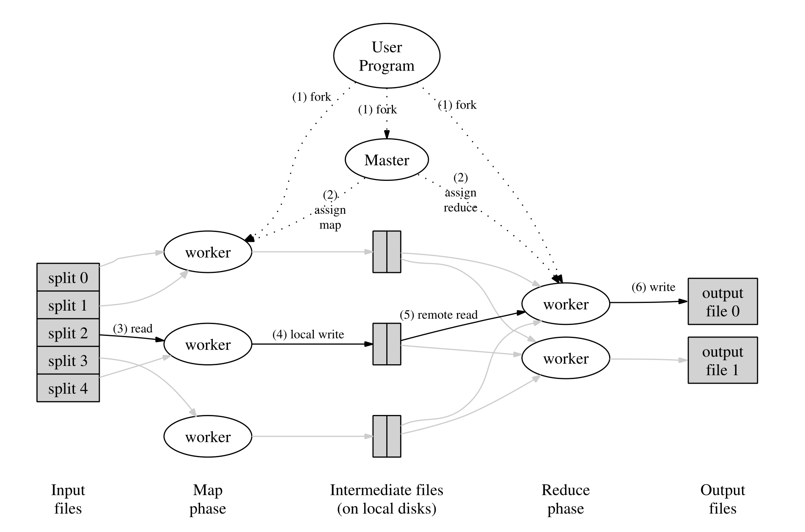

# 2020 MIT 6.824 分布式系统

B站视频： https://www.bilibili.com/video/av87684880/?vd_source=3b1ed19870f2784cfb57b2358a5f3fea

课程网站：https://pdos.csail.mit.edu/6.824/schedule.html

Availability

Recoverability

consistency    强一致性：保证每次GET得到最新的PUT版本    弱一致性：不做任何保证

## MapReduce

当用户程序调用MapReduce，The MapReduce library首先将输入文件分成M片（一般每片内存16-64MB），然后在集群里面启动程序的多个副本。其中一个副本是master节点，其余是工作节点。

