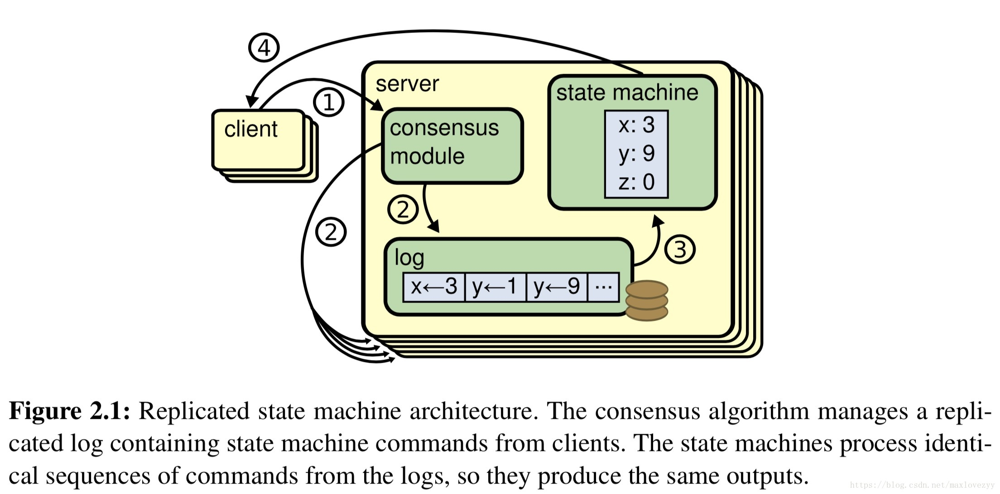
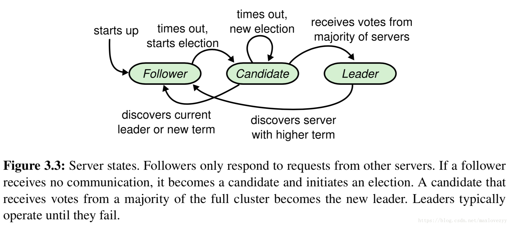
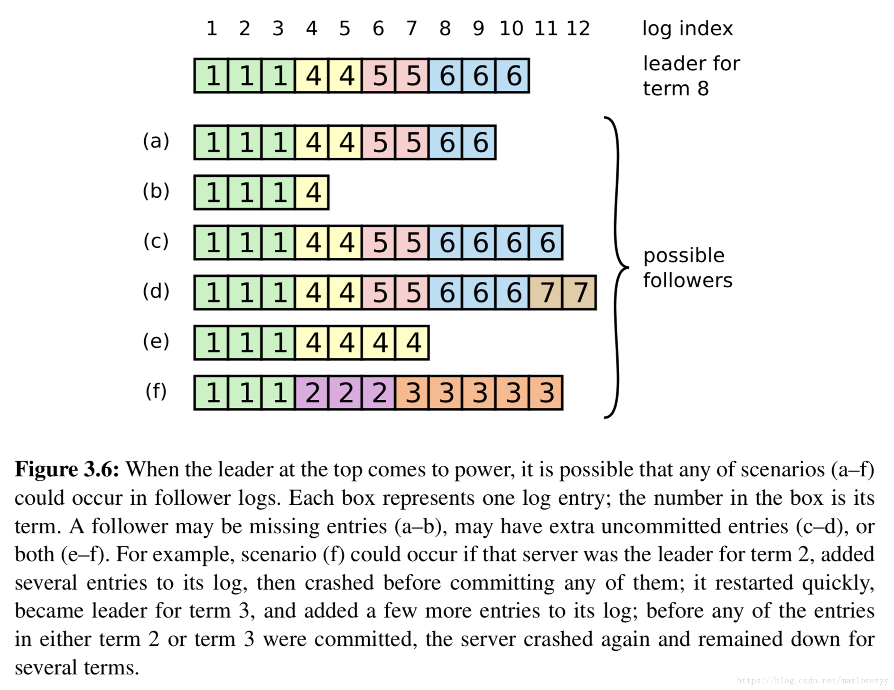
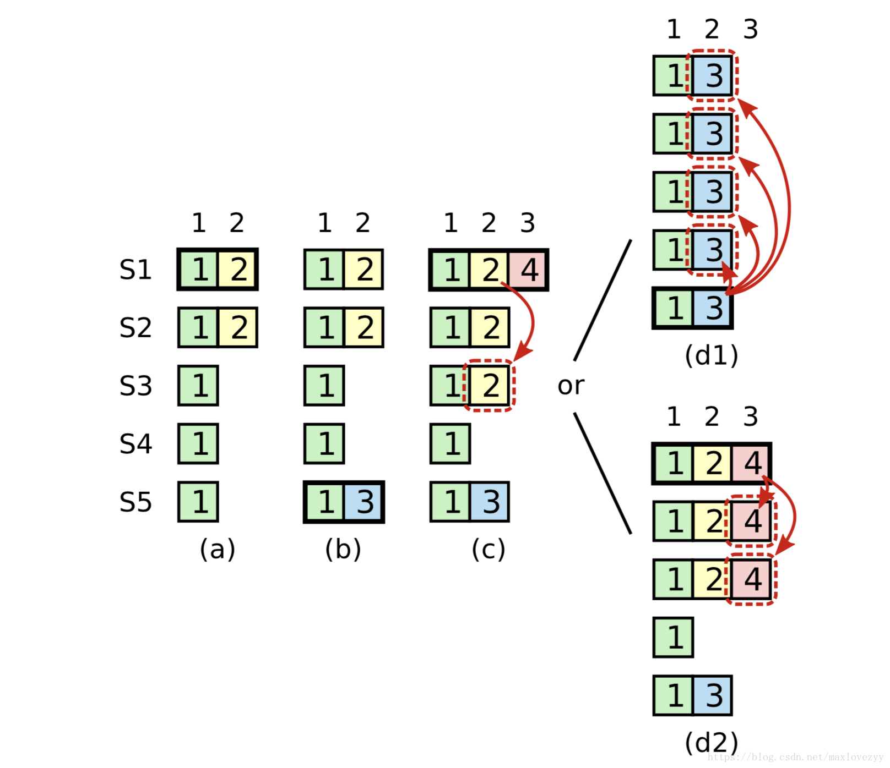

# 1.概述

Raft 是一种为了管理复制日志的一致性算法，为了提升可理解性，Raft 将一致性算法分解成了几个关键模块，例如领导人选举、日志复制和安全性。

特性：

- 强领导者：和其他一致性算法相比，Raft 使用一种更强的领导能力形式。比如，日志条目只从领导者发送给其他的服务器。这种方式简化了对复制日志的管理并且使得 Raft 算法更加易于理解。
- Raft 算法使用一个随机计时器来选举领导者。这种方式只是在任何一致性算法都必须实现的心跳机制上增加了一点机制。在解决冲突的时候会更加简单快捷。
- Raft 使用一种共同一致的方法来处理集群成员变换的问题，在这种方法下，处于调整过程中的两种不同的配置集群中大多数机器会有重叠，这就使得集群在成员变换的时候依然可以继续工作。

### 复制状态机

一致性算法是从复制状态机的背景下提出的。复制状态机在分布式系统中被用于解决很多容错的问题。例如，大规模的系统中通常都有一个集群领导者，像 GFS、HDFS 和 RAMCloud，典型应用就是一个独立的的复制状态机去管理领导选举和存储配置信息并且在领导人宕机的情况下也要存活下来。

复制状态机通常都是基于复制日志实现的，如图2.1。每一个服务器存储一个包含一系列指令的日志，并且按照日志的顺序进行执行。每一个日志都按照相同的顺序包含相同的指令，所以每一个服务器都执行相同的指令序列。因为每个状态机都是确定的，每一次执行操作都产生相同的状态和同样的序列。

保证复制日志相同就是一致性算法的工作了。在一台服务器上，一致性模块接收客户端发送来的指令然后增加到自己的日志中去。它和其他服务器上的一致性模块进行通信来保证每一个服务器上的日志最终都以相同的顺序包含相同的请求，尽管有些服务器会宕机。一旦指令被正确的复制，每一个服务器的状态机按照日志顺序处理他们，然后输出结果被返回给客户端。因此，服务器集群看起来形成一个高可靠的状态机。

# 2.Raft概览

https://blog.csdn.net/jingzi123456789/article/details/104871347

Raft是一个管理复制log组的算法。

Raft通过选举一个领导人，然后给予他全部的管理复制日志的责任来实现一致性。领导人从客户端接收日志条目，把日志条目复制到其他服务器上，并且当保证安全性的时候告诉其他的服务器应用日志条目到他们的状态机中。拥有一个领导人大大简化了对复制日志的管理。

一个 Raft 集群包含若干个服务器节点；通常是 5 个，这允许整个系统容忍 2 个节点的失效。在任何时刻，每一个服务器节点都处于这三个状态之一：领导人、跟随者或者候选人。

term任期在 Raft 算法中充当逻辑时钟的作用，这会允许服务器节点查明一些过期的信息比如陈旧的领导者。每一个节点存储一个当前任期号，这一编号在整个时期内单调的增长。当服务器之间通信的时候会交换当前任期号；如果一个服务器的当前任期号比其他人小，那么他会更新自己的编号到较大的编号值。如果一个候选人或者领导者发现自己的任期号过期了，那么他会立即恢复成跟随者状态。如果一个节点接收到一个包含过期的任期号的请求，那么他会直接拒绝这个请求。

Raft 算法中服务器节点之间通信使用远程过程调用（RPCs），并且基本的一致性算法只需要两种类型的 RPCs。

请求投票（RequestVote） RPCs 由候选人在选举期间发起，

附加条目（AppendEntries）RPCs 由领导人发起，用来复制日志和提供一种心跳机制。领导人转换(章节3.10机制在子章节中描述，介绍了一个两个一致性算法核心RPC之外的一个新的RPC。

### 领导人选举

服务器启动时，都是follower身份。领导者周期性的向所有跟随者发送心跳包（即不包含日志项内容的附加日志项 RPCs）来维持自己的权威。如果一个跟随者在一段时间里没有接收到任何消息，也就是选举超时，那么他就会认为系统中没有可用的领导者,并且发起选举成为candidate。

要开始一次选举过程，跟随者先要增加自己的当前任期号并且转换到候选人状态。然后他会并行的向集群中的其他服务器节点发送请求投票的 RPCs 来给自己投票。候选人会继续保持着当前状态直到以下三件事情之一发生：(a) 他自己赢得了这次的选举，(b) 其他的服务器成为领导者，(c) 一段时间之后没有任何一个获胜的人。

一旦候选人赢得选举，他就立即成为领导人。然后他会向其他的服务器发送心跳消息来建立自己的权威并且阻止新的领导人的产生。

第三种可能的结果是候选人既没有赢得选举也没有输：如果有多个跟随者同时成为候选人，那么选票可能会被瓜分以至于没有候选人可以赢得大多数人的支持。当这种情况发生的时候，每一个候选人都会超时，然后通过增加当前任期号来开始一轮新的选举。Raft 算法使用随机选举超时时间的方法来确保很少会发生选票瓜分的情况

# 3. 日志复制

一旦一个领导人被选举出来，他就开始为客户端提供服务。客户端的每一个请求都包含一条被复制状态机执行的指令。领导人把这条指令作为一条新的日志条目附加到日志中去，然后并行的发起附加条目 RPCs 给其他的服务器，让他们复制这条日志条目。

如果跟随者崩溃或者运行缓慢，再或者网络丢包，领导人会不断的重复尝试附加日志条目 RPCs （尽管已经回复了客户端）直到所有的跟随者都最终存储了所有的日志条目。领导人来决定什么时候把日志条目应用到状态机中是安全的；这种日志条目被称为已提交。

在 Raft 算法中，领导人处理不一致是通过强制跟随者直接复制自己的日志来解决了。这意味着在跟随者中的冲突的日志条目会被领导人的日志覆盖。

所有的这些操作都在进行附加日志 RPCs 的一致性检查时完成。领导人针对每一个跟随者维护了一个 nextIndex，这表示下一个需要发送给跟随者的日志条目的索引地址。当一个领导人刚获得权力的时候，他初始化所有的 nextIndex 值为自己的最后一条日志的index加1（图[3.6](https://blog.csdn.net/maxlovezyy/article/details/79942722#3.6)中的 11）。如果一个跟随者的日志和领导人不一致，那么在下一次的附加日志 RPC 时的一致性检查就会失败。在被跟随者拒绝之后，领导人就会减小 nextIndex 值并进行重试。最终 nextIndex 会在某个位置使得领导人和跟随者的日志达成一致。

# 4.安全性

这一节通过在领导选举的时候增加一些限制来完善 Raft 算法。这一限制保证了任何的领导人对于给定的任期号，都拥有了之前任期的所有被提交的日志条目

Raft 使用投票的方式来阻止一个候选人赢得选举除非这个候选人包含了所有已经提交的日志条目。候选人为了赢得选举必须联系集群中的大部分节点，这意味着每一个已经提交的日志条目在这些服务器节点中肯定存在于至少一个节点上。如果候选人的日志至少和大多数的服务器节点一样新（这个新的定义会在下面讨论），那么他一定持有了所有已经提交的日志条目。

图[3.7](https://blog.csdn.net/maxlovezyy/article/details/79942722#f3.7)展示了一种情况，一条已经被存储到大多数节点上的老日志条目，也依然有可能会被未来的领导人覆盖掉。

为了消除图[3.7](https://blog.csdn.net/maxlovezyy/article/details/79942722#f3.7)里描述的情况，Raft 永远不会通过计算副本数目的方式去提交一个之前任期内的日志条目。只有领导人当前任期里的日志条目通过计算副本数目可以被提交；一旦当前任期的日志条目以这种方式被提交，那么由于日志匹配特性，之前的日志条目也都会被间接的提交。

存储在大多数节点上的日志还是有可能被覆盖，也就是committed记录也有可能被丢掉。解决办法就是leader只commit自己这个term里的记录，不能commit之前term里的记录。

### 跟随者和候选人崩溃

跟随者和候选人崩溃后的处理方式比领导人要简单的多，并且他们的处理方式是相同的。如果跟随者或者候选人崩溃了，那么后续发送给他们的 RPCs 都会失败。Raft 中处理这种失败就是简单的通过无限的重试；

### 持久化状态和服务重启

Raft服务(server)必须持久化足够的信息保证服务安全的重启。特别地，每一个服务需要持久化当前的任期(term)和投票(vote)，这是必要的，以防止服务器在相同的期限内投票两次，或者将来自新领导者的日志条目替换为来自已废弃领导者的日志条目。每一个服务也要在统计日志提交状态之前持久化该日志，这会防止已提交的日志丢失或者当服务重启的时候实际情况变成了未提交了。

### 时间和可用性

Raft 的要求之一就是安全性不能依赖时间：整个系统不能因为某些事件运行的比预期快一点或者慢一点就产生了错误的结果。但是，可用性（系统可以及时的响应客户端）不可避免的要依赖于时间。例如，如果消息交换在服务器崩溃时花费更多的时间，候选人将不会等待太长的时间来赢得选举；没有一个稳定的领导人，Raft 将无法工作。

领导人选举是 Raft 中对时间要求最为关键的方面。Raft 可以选举并维持一个稳定的领导人,只要系统满足下面的时间要求：

> 广播时间（broadcastTime） << 选举超时时间（electionTimeout） << 平均故障间隔时间（MTBF）
>
> 

在这个不等式中，广播时间指的是从一个服务器并行的发送 RPCs 给集群中的其他服务器并接收响应的平均时间；选举超时时间就是在[3.4](https://blog.csdn.net/maxlovezyy/article/details/79942722#s3.4)节中介绍的选举的超时时间限制；然后平均故障间隔时间就是对于一台服务器而言，两次故障之间的平均时间。广播时间必须比选举超时时间小一个量级，这样领导人才能够发送稳定的心跳消息来阻止跟随者开始进入选举状态；通过随机化选举超时时间的方法，这个不等式也使得选票瓜分的情况变得不可能。选举超时时间应该要比平均故障间隔时间小上几个数量级，这样整个系统才能稳定的运行。当领导人崩溃后，整个系统会大约相当于选举超时的时间里不可用；我们希望这种情况在整个系统的运行中很少出现。

广播时间和平均故障间隔时间是由系统决定的，但是选举超时时间是我们自己选择的。Raft 的 RPCs 需要接收方将信息持久化的保存到稳定存储中去，所以广播时间大约是 0.5 毫秒到 20 毫秒，取决于存储的技术。因此，选举超时时间可能需要在 10 毫秒到 500 毫秒之间。大多数的服务器的平均故障间隔时间都在几个月甚至更长，很容易满足时间的需求。

